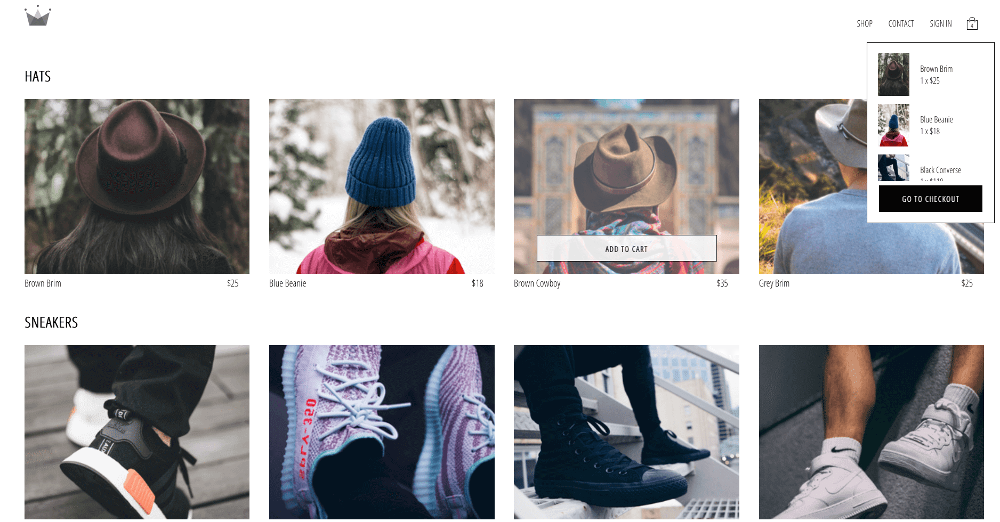

## CRWN CLOTHING
E-commerce website developed entirely using React and Redux.
This is to act as a starter for a similar project. 

Live demo: <a href="https://crwn-clothing-au.herokuapp.com/">HERE</a>

This website feature:

- Products browsing by category
- Adding to cart
- Managing cart
- Payment using Stripe API

### NOTE
To use the Google Signin / Signup you need to create a project in your google console and place your API KEY or remove the feature and simply use email and password for authentication.

### DATABASE
The choice for this project was Firebase Firestore

### HOW TO USE 
 - Clone the project in your folder
 - Install all dependencies using<br/>
    ``` npm install ``` or ``` yarn ``` depending on your package manager
 - Start the project on localhost
    ``` npm start ``` or ``` yarn start ```
    
    
